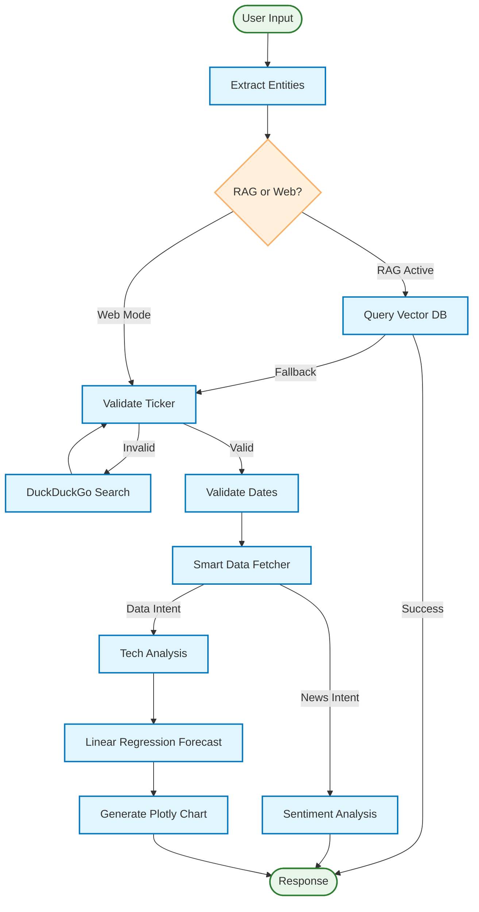

# 📈 Trader Companion AI


-black?logo=ollama)


**Trader Companion AI** is an autonomous financial agent that combines real-time stock analysis with private document retrieval (RAG).

Unlike simple chatbots, this agent uses a **cyclic graph architecture** to self-correct errors. If it can't find a ticker (e.g., "Boralex"), it searches the web, verifies candidates against official listings, checks for name collisions, and validates data availability before answering.

---

## 🧭 High-Level Flow (Agent Graph)

The diagram below illustrates how the agent routes intent, validates tickers, self-corrects failures, and produces analysis or RAG-based answers.



---

## 🧠 System Architecture

The agent is powered by **LangGraph**, enabling non-linear workflows and state persistence. The system operates through a specialized node architecture:

* **Router Logic:** Intelligently decides between pulling real-time market data, searching the web for news, or querying the internal Knowledge Base (PDFs) based on user intent.
* **Self-Correction Loop:** If a stock ticker is invalid or ambiguous, the agent enters a fallback loop—searching the web, verifying exchange suffixes (e.g., converting `.TSX` to `.TO`), and validating against official company names before proceeding.
* **Hybrid Search:** Combines DuckDuckGo for general queries and a local Vector Store (Ollama embeddings) for private document analysis.

---

## ✨ Key Capabilities

### 1. 🛡️ Robust Ticker Resolution

* **Self-Correction:** Automatically maps informal names (e.g., "Ubisoft") to accurate tickers (`UBI.PA`) using a multi-step web search and validation loop.
* **Collision Detection:** Uses fuzzy matching to distinguish between similar tickers (e.g., `BLX` for Boralex vs. Banco Latinoamericano).
* **Suffix Handling:** Automatically converts exchange suffixes (e.g., `.TSX` → `.TO`) for API compatibility.

### 2. 🧠 Smart Routing

* Detects intent to route between **Fundamental Analysis**, **Technical Charts**, **News Sentiment**, or **Internal RAG** queries.
* **Keyword Guards:** Bypasses LLM latency for direct data requests (e.g., "Show me the price of Apple").

### 3. 📊 Interactive Visualization

* Generates dynamic **Plotly** charts with zoom/pan.
* Overlays **SMA (Simple Moving Average)** and **RSI (Relative Strength Index)**.
* Projects a 7-day trend forecast using Linear Regression.

### 4. 📚 Local RAG (Retrieval-Augmented Generation)

* Ingests PDF reports into an in-memory Vector Store.
* Uses **Ollama (nomic-embed-text)** for fully local, private document analysis.

---

## 🛠️ Installation & Setup

### Option 1: Docker (Recommended)

```bash
# Build the image
docker build -t trader-ai .

# Run the container (Exposes port 7860)
docker run -p 7860:7860 trader-ai
```

### Option 2: Local Development

Requires Python 3.11+ and [Ollama](https://ollama.com/) running locally.

1. **Clone and Install**

   ```bash
   git clone https://github.com/yourusername/trader-companion.git
   cd trader-companion
   pip install -r requirements.txt
   ```

2. **Start Ollama**

   ```bash
   ollama pull qwen2.5:7b
   ollama pull nomic-embed-text
   ollama serve
   ```

3. **Run Streamlit**

   ```bash
   streamlit run app.py
   ```

---

## 🧪 Testing

```bash
# Run all tests
pytest tests/test_agent.py

# Run specific ticker validation tests
pytest -k "validate_ticker"
```

---

## ⚠️ Disclaimer

*This project is for educational purposes only. The financial forecasts and analysis provided by the AI are based on simple statistical models and should not be used as financial advice.*
